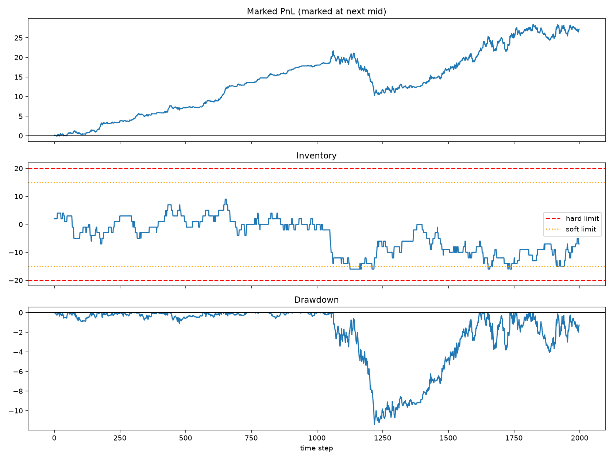

# Independent Order-Book Market-Making Bot

A reproducible Python notebook by **Junhao Li** that explores top-of-book valuation, inventory-aware quoting, and cash/inventory accounting on synthetic data. This is an educational simulation, with no exchange connection or external data requirement. The notebook retains the original bilingual research notes; this README describes the implemented scope in English.

## My contribution

I built the synthetic market generator, mid-price and microprice functions, tick-aligned quotes, inventory skew and size controls, fill ledger, and repeated order-flow experiments in the original notebook. The publication cleanup preserves that structure and adds explicit execution limits, corrected risk diagnostics, and a reproducible command-line runner. See [AUDIT.md](AUDIT.md) for the precise corrections.

## Data and methods

The notebook generates 2,000 synthetic top-of-book snapshots with market seed `7`. There are no historical prices, proprietary datasets, credentials, or private API adapters in this repository.

- Latent imbalance follows an AR(1) process with coefficient `0.75`, then a `tanh` transform. The next mid-price change has a `0.012 * previous_imbalance` component plus Gaussian noise with standard deviation `0.025`.
- The external bid/ask spread is fixed at `0.10`. Synthetic depth provides the observed imbalance; the strategy does not read the simulator's `true_imbalance` column directly.
- `microprice = (ask * bid_size + bid * ask_size) / (bid_size + ask_size)`. A mid-price helper is also implemented, but the experiment only trades the microprice strategy; there is no claimed mid-versus-microprice A/B result.
- Reservation price is `microprice - 0.025 * inventory`. Quotes use a `0.08` half-spread, widened to `0.11` when the preceding absolute mid-price move exceeds `0.05`; prices round outward to a `0.01` tick.
- Normal order size is `2`, reduced to `1` in the volatile state. The hard position limit is `20`; at 75% of that limit, quotes that increase the existing position are disabled. Each side is also capped by its remaining hard-limit capacity. A stale-data flag disables both sides, though staleness is not generated in the simulation.
- Independent Bernoulli draws represent aggressive buy/sell arrivals, with probabilities `clip(0.075 +/- 0.030 * observed_imbalance, 0.02, 0.13)`. Arrivals fill the entire relevant bot quote. Fees are `0.005` per unit.
- Marked PnL is `cash + inventory * next_mid`. The notebook reports a single run with order-flow seed `123`, then 100 order-flow seeds `0..99` on the **same** synthetic price path.

## Run

Python 3.12 is the verified interpreter. Create an environment and install the requirements:

```bash
python -m venv .venv
# Windows PowerShell: .venv\Scripts\Activate.ps1
# macOS/Linux: source .venv/bin/activate
python -m pip install -r requirements.txt
python run_notebook.py --output-dir results
```

The command executes every notebook code cell sequentially, runs risk/rounding/accounting checks, and writes `summary.json`, `execution.log`, `single_run.csv`, `trial_results.csv`, and `diagnostics.png`. It uses a noninteractive plotting backend and performs no network requests. Generated files under `results/` are ignored by Git. The dependency bounds allow compatible updates; exact versions used for the checked run appear in the verified summary.

For interactive use, run `jupyter lab market_making_toy.ipynb` and choose **Restart Kernel and Run All Cells**. Published notebook execution counts and outputs are cleared so that a fresh run is explicit.

## Verified results

All 13 code cells (including one empty cell) executed successfully offline on 20 September 2026 with Python 3.12.14, NumPy 2.5.3, pandas 3.0.6, and Matplotlib 3.11.2. Risk, tick-rounding, cash, and inventory checks passed. The single-run accounting and quotes also match the supplied original notebook exactly under the default parameters.

| Synthetic experiment | Verified value |
| --- | ---: |
| Single-run final marked PnL, after fees | 27.203143 |
| Single-run maximum absolute drawdown | 11.412259 |
| Single-run maximum absolute inventory | 16 |
| Single-run terminal inventory | -7 |
| Bought / sold units | 274 / 281 |
| Mean final marked PnL across 100 order-flow seeds | 32.773709 |
| Median final marked PnL across 100 order-flow seeds | 33.466204 |
| Positive-PnL fraction across those seeds | 100% |
| Maximum absolute inventory across those seeds | 16 |

These are outputs of the specified toy fill mechanism, in arbitrary price-times-quantity units. The 100% positive fraction is a simulator outcome, not a claim about live performance or statistical significance. Exact values, notebook hash, settings, and runtime versions are in [verified_results/summary.json](verified_results/summary.json); the 100 final PnLs are in [verified_results/trial_results.csv](verified_results/trial_results.csv).



## Interpretation and limits

The fill model is deliberately simple and economically unrealistic: **fill probability does not depend on quote distance, queue priority, competing best quotes, or consumed depth**. Widening a quote does not reduce its fill probability. This can mechanically inflate simulated spread capture. Synthetic profitability therefore does not establish a profitable trading strategy.

The simulator does not model partial fills, latency, outstanding-order lifecycle, asynchronous cancel acknowledgements, message budgets, market impact, or terminal liquidation. `inventory_bounds()` illustrates pending-order exposure but is not an order-management system and is not used by the immediate-fill loop. The introductory exchange-integration checklist is future work.

PnL and drawdown are absolute price-times-quantity units, not currency-calibrated returns. Marked PnL includes per-unit fees; remaining inventory is valued at the next mid without a liquidation charge. Fill-price markout is reported before fees. Signed mid-price drift is a separate quantity-weighted diagnostic, not a realized return.

The 100-seed experiment varies order arrivals on a single generated market path. It is not a set of independent historical samples, an out-of-sample test, a statistical significance test, or evidence of live execution quality. No ProductionLevel notebook is included in this release.

## Files

- `market_making_toy.ipynb`: synthetic generator, strategy, ledger, experiments, and plots.
- `run_notebook.py`: offline execution, accounting/risk checks, and result export.
- `requirements.txt`: Python dependencies.
- `.gitignore`: local environments, caches, credentials, and generated-run exclusions.
- `AUDIT.md`: source provenance, fixes, and verified scope.
- `verified_results/summary.json`: exact results and runtime versions from the checked run.
- `verified_results/trial_results.csv`: final marked PnL for each of the 100 order-flow seeds.
- `verified_results/diagnostics.png`: plot generated by the verified single-run experiment.
